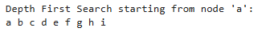

# HandsOn_14

# Problem 1

* Code for Topological sort is given [`TopologicalSortExample.py`](TopologicalSortExample.py)

 

 
 

# Problem 2

* Code for Depth-First Search is given [`GraphDFS.py`](GraphDFS.py)

 

 
 

# Problem 3

* Code for KruskalAlgorithm is given [`KruskalAlgorithm.py`](KruskalAlgorithm.py)

 

